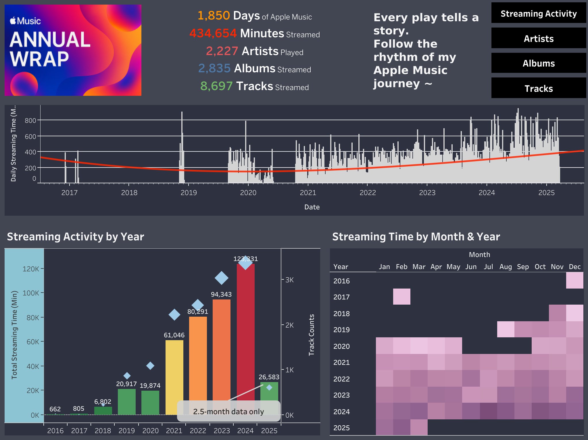

# 🎵 My Apple Music Unwrapped

**Visualizing my multi-year Apple Music streaming history using Tableau**

---

## 📊 Dashboard

🔗 [View it on Tableau Public](https://public.tableau.com/views/MyAppleMusicUnwrapped/Dashboard1-Start?:language=en-US&:sid=&:redirect=auth&:display_count=n&:origin=viz_share_link)

---

## 📋 Overview

This Tableau dashboard explores trends and patterns in my Apple Music listening history since the start of using the streaming platform (2016-). Inspired by the idea of Spotify Wrapped, it provides a personal and interactive summary of:

- Listening patterns (duration, distribution, location) over time
- Most streamed artists, albums, tracks (yearly and all-time)
- Soundtrack vs. non-soundtrack breakdown

---

## 📁 Project Structure

- `My_Apple_Music_Unwrapped.twbx` – Main Tableau workbook
- `images/` – Contains dashboard preview images and images used.
- `data/` – Data used for the visualization.
- 2 Jupyter Notebooks - For cleaning and formatting the final datasets to be visualized in Tableau.

---

## 📂 Data

The data used in this project comes from Apple Music’s personal streaming history, obtained from Apple.

**Raw data:**
- `Apple Music Play Activity.csv`: Contains every track play record (except Artist info). [Note: Not uploaded due to privacy]
- `Apple Music - Track Play History.csv`: Recently (2024 - current) played track information (track_name and artist_name).

**Main datasets** (for Tableau Viz):
- `final_am_dataset_tableau.csv`
- `artist_duration_data.csv`

**Other data** (intermediate files saved during data cleaning/manipulating):
- `separate_track_names.csv`: Split track and artist columns from `Track Play History` file.
- `matching_df.csv`: An initial matching result between two raw data files.
- `final_manual_reviewed_df.csv`: Matching file after some manual review.

---

## ❗️Limitations

The analysis is constrained by the available data from AM export, which lacks consistent track-level metadata, such as a clear one-to-one mapping between track, album, and artist, and musical information of tracks (such as genre, tempo and other acoustic features), which limits deeper insight into the musical characteristics of streaming preference and habits. Some of these attributes were previously accessible via the Spotify API, but recent access restrictions have made it unfeasible. Nevertheless, the current datasets still offers valuable personal insights through playback patterns, time-based trends, and artist engagement and preferences over multiple years.

## 📸 Preview

